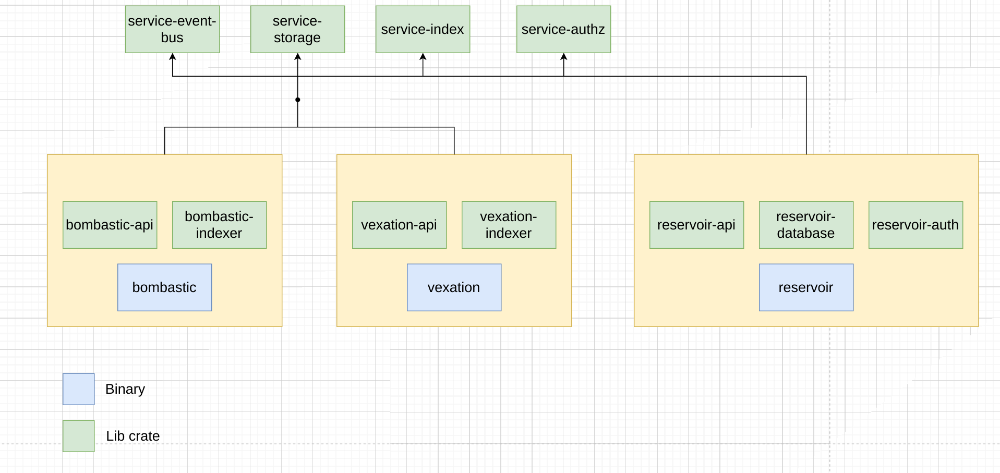

# SCTM Phase 1 services

This RFC defines the initial services in phase 1 of Supply-Chain Trust Manager (SCTM) and how they relate to Rust crates for the three services Bombastic, Vexation and Reservoir.
## Glossary 

* SCTM - Supply-Chain Trust Manager

## Design

* Monorepo but with separate directories for individual services. This makes it easier to track GitHub issues, doing cross-service commits and so on.
* Each of the services has a binary that can be used to run the service. This improves developer productivity in that each service can quickly be spun up. They can also easily share 'common infrastructure' such as sso, object storage, event bus etc.
* Crates for accessing storage (s3), index (sqlite) and event bus (kafka/sqs) are put in shared lib crates to increase code reuse, while keeping boundaries between services.

