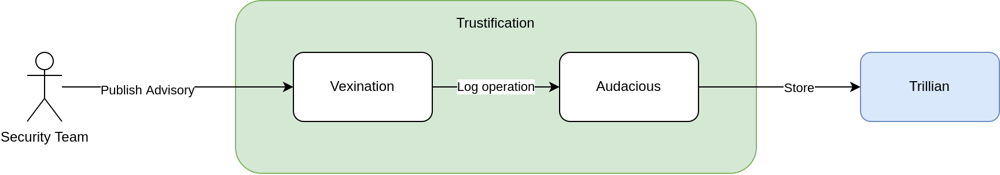

# Auditability

Trustification services permit different parties to publish and make modifications to data. In the event of a security breach or for analysis purposes, an immutable audit log of modifications made to the system is useful.  The audit log should provide
answers to the following questions:

* What happened?
* When did it happen?
* Who initiated it?
* What did it happen to?
* Which service was involved?

This RFC describes the set of actions in trustification that can benefit from being auditable, as well as a possible way to achieve auditability of those actions.

## Design 

The entry point for audit logging and reading is via a new trustification service named 'Audacious'. This service is primarly a facade to an underlying audit log, but all audit logging is going through the 'Audacious' API. The reason for this
is that Trustification should provide a unified way to manage access to audit log in the same way as for other services. It also allows for changing the audit log implementation more easily should it be needed.

### What data is logged

* The operation: write, modify or delete
* Service which logged the entry
* Who made the operation, derived from access token
* Which resource the operation was made to
* Timestamp: when the operation was done

### Auditable actions

All actions that create or modifies some state in the system should be auditable. Read operations are not auditable as the underlying assumption in trustification services is that they generally do not cause harm but also far more common.

The write operations allowed by trustification are at present:

* Write/Modify/Delete SBOM
* Write/Modify/Delete VEX

In addition, these operations are likely to be part of Reservoir or whatever manages authorization:

* Create/Delete namespace
* Grant ownership of package namespace
* Delegate write/read access to package namespace
* Delegate write/read access to advisory namespace

### Audit log

For Create/Update operations of content, there is already a plan to have the services sign the content on upload. This will most likely use [Sigstore](https://sigstore.dev), and would provide audit capabilties via Sigstore. However, operations such as delete and authz policy operations do not relate directly to artifact content, therefore do not the intended use of Sigstore. 

An alternative would be to use a system such as [trillian](https://github.com/google/trillian), which is already used by Rekor.

### Access

Access to the audit log is covered by a separate role in the authentication and authorization service, similar to how it will be managed for other services.

### Flow

The flow of a publish operation is shown below:



Other audit logging operations will follow the same flow via the audit service.

### API

#### Logging data

```
POST /api/v1/audit
Content-type: application/json
Body:
{
   "op": "WRITE" | "MODIFY" | "DELETE",
   "service": "vexination",
   "actor": "user identity or public key"
   "resource": {
     "type": "VEX",
     "id": "RHSA-2023:1441"
   },
   "timestamp": "1985-05-03T13:20:50.52Z"
}
```

#### Reading data

* Entries within a timestamp range: `GET /api/v1/audit?from=2022-01-01&to=2023-01-01`
* Entries with write operation: `GET /api/v1/audit?op=WRITE`
* Entries for a given resource type `GET /api/v1/audit?resourceType=VEX`
* Entries for a given resource type `GET /api/v1/audit?resourceType=VEX&id=RHSA-2023:1441`
